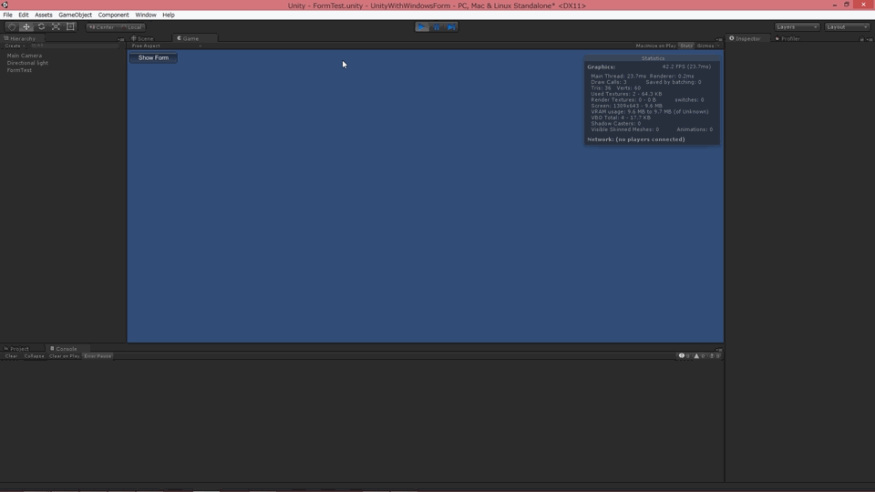

Unity with Windows Form
========
Visual Studio のフォームデザイナで作った GUI を Unity で使う例です。  

以下の事前準備が必要です。  
1. Edit -> Project Settings -> Player -> Other Settings の API Compatibility Level を ".NET 2.0" に変更する  
2. 必要なアセンブリを C:\Program Files (x86)\Unity\Editor\Data\Mono\lib\mono\2.0 から Assets/Plugins にコピーする (System.Windows.Forms.dll, System.Drawing.dll, System.Data.dll は最低限必要)  

あとはごく普通に Visual Studio で GUI を作ってそれを new して Show() するだけで表示できます。GUI から Unity の機能にアクセスすることも可能です。  
Unity がプロジェクトファイルを再生成するとフォームデザイナの情報が失われてしまうので、専用のプロジェクトを別に作っておいた方がいいでしょう。  

